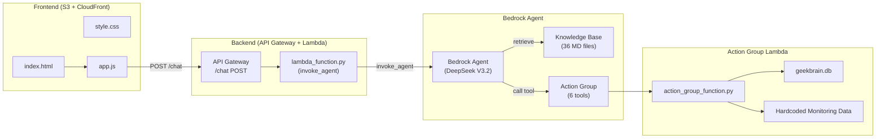
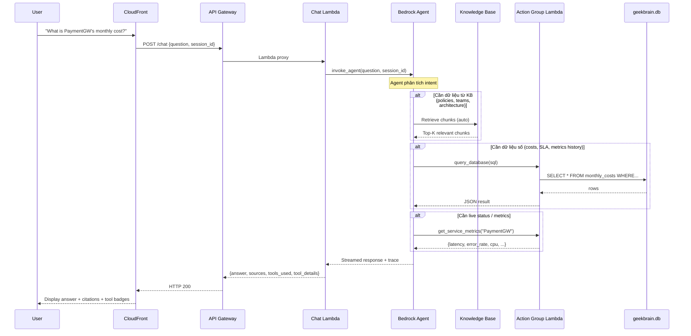

# 🔍 Build Analysis — L1 / L2 / L3 Compliance Report

## Tổng quan Kiến trúc hiện tại



---

## L1 — Simple RAG ✅ ĐẠT

### Yêu cầu L1
| Yêu cầu | Status | Cách triển khai |
|----------|--------|-----------------|
| Upload 36 MD docs lên S3 | ✅ | `ai_engine/main.tf` — `aws_s3_object.kb_files` dùng `fileset("*.md")` |
| Tạo Bedrock Knowledge Base | ✅ | `aws_bedrockagent_knowledge_base.main` + OpenSearch Serverless |
| Embedding model | ✅ | `amazon.titan-embed-text-v2:0` (dimension=1024) |
| Chunking strategy | ✅ | **HIERARCHICAL** — parent 1500 tokens, child 300 tokens, overlap 60 tokens |
| Data source + ingestion | ✅ | `aws_bedrockagent_data_source.s3` + `null_resource.kb_sync` auto-sync |
| Lambda xử lý câu hỏi | ✅ | `lambda_function.py` → `invoke_agent()` |
| API Gateway endpoint | ✅ | `POST /chat` → Lambda proxy |
| Frontend UI | ✅ | `index.html` + `app.js` + `style.css` qua CloudFront |
| Trả sources/citations | ✅ | Extract từ `chunk.attribution.citations` + KB retrieval trace |

### Ghi chú L1
- Chunking config rất tốt: **Hierarchical** (1500/300/60) — đúng recommendation
- OpenSearch Serverless dùng HNSW (faiss, L2, m=16, ef=512) — cấu hình tối ưu
- KB sync tự động khi MD files thay đổi (trigger bằng `docs_hash`)

---

## L2 — Multi-Source Synthesis & Conflict Resolution ✅ ĐẠT

### Yêu cầu L2
| Yêu cầu | Status | Cách triển khai |
|----------|--------|-----------------|
| Tăng retrieval K | ✅ | `retrieval_k = 10` (default, truyền vào backend module) |
| Conflict resolution trong prompt | ✅ | Agent instruction rule #3: ưu tiên `status="current"` > `"archived"`, nêu rõ xung đột |
| Metadata injection | ✅ | Upload `.metadata.json` files lên S3 (cùng bucket với MD files) |
| Hybrid Search | ⚠️ **KHÔNG CÒN DÙNG TRỰC TIẾP** | `L2_improvements.md` mô tả HYBRID search nhưng **code thực tế dùng Bedrock Agent** (Agent tự quản lý KB retrieval, không dùng `bedrock_agent_runtime.retrieve()` nữa) |

### Phân tích chi tiết L2

**Kiến trúc đã THAY ĐỔI từ L1→L2→L3:**

`L2_improvements.md` mô tả kiến trúc L2 gốc (trước khi chuyển sang L3):
- L2 gốc: Lambda trực tiếp gọi `bedrock_agent_runtime.retrieve()` rồi ghép context → gọi LLM
- L3 hiện tại: Lambda gọi `bedrock_agent_runtime.invoke_agent()` → Agent tự xử lý KB + tools

> [!IMPORTANT]
> **`lambda_function.py` hiện tại KHÔNG chứa code HYBRID search hay format_context** — nó chỉ invoke Bedrock Agent. Các tính năng L2 (conflict resolution, metadata awareness) được chuyển hoàn toàn vào **Agent instruction prompt** thay vì code Lambda.

**Tuy nhiên, L2 vẫn ĐẠT vì:**
1. **Conflict resolution** — nằm trong agent instruction (rule #3)
2. **Metadata** — file `.metadata.json` đã upload lên S3, Bedrock KB sẽ index metadata
3. **Multi-source** — K=10 chunks, agent tự quyết tổng hợp
4. HYBRID search phụ thuộc vào cách cấu hình KB — nếu đã enable trên Bedrock console thì OK

---

## L3 — Tool-Augmented RAG ✅ ĐẠT (6/7 tools)

### Action Group — 6 Tools

Bedrock Agent có **1 Action Group** tên `${project}-tools` với **6 functions** được define trong Terraform `function_schema`:

---

### 🔧 Tool #1: `query_database`

| Thuộc tính | Giá trị |
|-----------|---------|
| **Parameter** | `sql_query` (string, required) |
| **Mục đích** | Query dữ liệu lịch sử từ SQLite (costs, SLA, metrics, incidents) |
| **Trigger** | Câu hỏi về chi phí cụ thể, SLA targets, daily metrics, historical data |

**Cách chạy trong Lambda:**
```python
def query_database(sql_query):
    # 1. Kiểm tra chỉ cho phép SELECT (chặn INSERT/UPDATE/DELETE)
    if not sql_query.strip().upper().startswith("SELECT"):
        return {"error": "Only SELECT queries are allowed."}
    
    # 2. Kết nối SQLite file geekbrain.db (bundled trong Lambda ZIP)
    conn = sqlite3.connect(DB_PATH)  # DB_PATH = cùng thư mục với lambda
    
    # 3. Execute query và trả kết quả
    cursor.execute(sql_query)
    return {"columns": [...], "rows": [...], "row_count": N}
```

**Database schema (4 bảng):**
- `monthly_costs` — 36 rows (6 services × 6 tháng Oct'25–Mar'26)
- `incidents` — 8 rows (INC-001 → INC-008)
- `sla_targets` — 18 rows (6 services × 3 metrics)
- `daily_metrics` — 540 rows (6 services × 90 ngày)

---

### 🔧 Tool #2: `get_service_status`

| Thuộc tính | Giá trị |
|-----------|---------|
| **Parameter** | `service_name` (string, required) |
| **Mục đích** | Trạng thái vận hành HIỆN TẠI của 1 service |
| **Trigger** | "Is X running?", "Is X healthy?", "Any alerts on X?" |

**Cách chạy trong Lambda:**
```python
def get_service_status(service_name):
    # Tra cứu từ dict SERVICE_STATUS (hardcoded)
    return SERVICE_STATUS[service_name]
    # Trả về: status, uptime_30d, uptime_90d, active_alerts, last_incident
```

**Dữ liệu hardcoded đáng chú ý:**
- `NotificationSvc` → `status: "degraded"`, `active_alerts: 2` (queue depth + consumer latency)
- Tất cả service khác → `status: "healthy"`

---

### 🔧 Tool #3: `get_service_metrics`

| Thuộc tính | Giá trị |
|-----------|---------|
| **Parameter** | `service_name` (string, required) |
| **Mục đích** | Metrics hiệu năng LIVE (latency, error rate, CPU, memory) |
| **Trigger** | "What is X's latency?", "How many req/min?", "X's error rate?" |

**Cách chạy trong Lambda:**
```python
def get_service_metrics(service_name):
    base = BASE_METRICS[service_name]
    # Áp dụng ±5% jitter để giả lập real-time variation
    return {
        "service": service_name,
        "timestamp": "2026-05-07T...",  # current UTC
        "latency_ms": {"p50": jitter(45), "p95": jitter(120), "p99": jitter(185)},
        "error_rate_percent": jitter(0.08),
        "requests_per_minute": jitter(12500),
        "cpu_utilization_percent": jitter(62),
        "memory_utilization_percent": jitter(71),
    }
```

**Metrics cơ sở quan trọng:**

| Service | p99 Latency | Error Rate | RPM | CPU | Memory |
|---------|-------------|------------|-----|-----|--------|
| PaymentGW | 185ms | 0.08% | 12,500 | 62% | 71% |
| AuthSvc | 45ms | 0.005% | 28,000 | 45% | 40% |
| OrderSvc | 320ms | 0.2% | 4,200 | 38% | 55% |
| FraudDetector | 120ms | 0.03% | 12,500 | 72% | 65% |
| **NotificationSvc** | **3200ms** | **2.1%** | 1,800 | **88%** | **92%** |
| ReportingSvc | 2100ms | 0.5% | 350 | 55% | 68% |

> [!WARNING]
> **NotificationSvc** đang ở trạng thái degraded rõ ràng: p99 = 3.2s, error rate = 2.1%, CPU = 88%, Memory = 92%. Đây là dữ liệu sẽ được test — AI phải nhận ra được điều này.

---

### 🔧 Tool #4: `list_services`

| Thuộc tính | Giá trị |
|-----------|---------|
| **Parameter** | Không có |
| **Mục đích** | Liệt kê tất cả 6 services |
| **Trigger** | "What services does GeekBrain have?" |

```python
def list_services():
    return {"services": ["PaymentGW", "AuthSvc", "OrderSvc", 
                          "FraudDetector", "NotificationSvc", "ReportingSvc"]}
```

---

### 🔧 Tool #5: `get_incident_history`

| Thuộc tính | Giá trị |
|-----------|---------|
| **Parameter** | `service_name` (string, required) — hoặc `"all"` |
| **Mục đích** | Lịch sử incident từ monitoring system |
| **Trigger** | "What incidents happened to X?", "Root cause of INC-005?" |

```python
def get_incident_history(service_name):
    if service_name == "all":
        return {"incidents": INCIDENTS}  # 6 incidents hardcoded
    return {"incidents": [i for i in INCIDENTS if i["service"] == service_name]}
```

**6 incidents hardcoded** (không phải 8 như DB):

| ID | Service | Severity | Root Cause |
|----|---------|----------|------------|
| INC-001 | PaymentGW | P2 | DB connection pool exhausted |
| INC-004 | AuthSvc | P2 | JWT key rotation script failed |
| INC-005 | PaymentGW | P1 | Circuit breaker stuck OPEN |
| INC-006 | FraudDetector | P2 | Model drift |
| INC-007 | NotificationSvc | P3 | SQS DLQ overflow |
| INC-008 | ReportingSvc | P2 | ETL pipeline timeout |

> [!NOTE]
> Tool này có **6 incidents** (hardcoded), trong khi `query_database` truy cập DB có **8 incidents** (INC-001→INC-008). **Thiếu INC-002 và INC-003** trong hardcoded data.

---

### 🔧 Tool #6: `compare_services`

| Thuộc tính | Giá trị |
|-----------|---------|
| **Parameter** | `metric` (string, required) — `latency_p99` / `error_rate` / `requests_per_minute` |
| **Mục đích** | Rank 6 services theo 1 metric (cao→thấp) |
| **Trigger** | "Which service has highest latency?", "Rank by error rate" |

```python
def compare_services(metric):
    results = {}
    for svc in SERVICES:
        m = get_service_metrics(svc)  # Gọi internal, có jitter
        if metric == "latency_p99":
            results[svc] = m["latency_ms"]["p99"]
        elif metric == "error_rate":
            results[svc] = m["error_rate_percent"]
        elif metric == "requests_per_minute":
            results[svc] = m["requests_per_minute"]
    return {"metric": metric, "ranking": sorted_results}
```

---

## Đối chiếu với Yêu cầu 7 Tools (W4 Project Announcement)

Theo `W4_project_announcement.md`, L3 cần tối thiểu **7 tools**:

| # | Tool yêu cầu | Có trong Build? | Tên trong Action Group |
|---|-------------|----------------|----------------------|
| 1 | `query_database(sql)` | ✅ | `query_database` |
| 2 | `get_service_status(name)` | ✅ | `get_service_status` |
| 3 | `get_service_metrics(name)` | ✅ | `get_service_metrics` |
| 4 | `list_services()` | ✅ | `list_services` |
| 5 | `get_incident_history(service)` | ✅ | `get_incident_history` |
| 6 | `compare_services(metric)` | ✅ | `compare_services` |
| 7 | `get_cost_analysis(service,period)` | ❌ **THIẾU** | — |

> [!CAUTION]
> **THIẾU tool `get_cost_analysis`!** Hiện tại chỉ có 6/7 tools. Agent phải dùng `query_database` với SQL query để lấy cost data thay vì có 1 tool chuyên dụng. Điều này vẫn work nhưng không matching 100% yêu cầu ghi trong project announcement.

---

## Frontend — Trạng thái

| Feature | Status | Ghi chú |
|---------|--------|---------|
| Chat UI (dark theme) | ✅ | Thiết kế glassmorphism đẹp, Inter font |
| Quick prompts (5 câu) | ✅ | L1/L2 focused questions |
| Source citation tags (green) | ✅ | Hiển thị filename |
| Tool badges (purple) | ✅ | Hiển thị tool name |
| Collapsible query details | ✅ | SQL query / parameters |
| Session management | ✅ | `sessionStorage` — hỗ trợ L4 memory |
| Sidebar info card | ✅ | Model, KB docs, Embedding, Level badge |
| Responsive mobile | ✅ | Sidebar ẩn < 768px |
| API URL injection | ✅ | Terraform inject `window.GEEKBRAIN_API_URL` |

> [!NOTE]
> Sidebar hiển thị **"Level: L1 + L2"** — cần cập nhật thành **"L3"** vì đã có Action Group.

---

## Data Flow — Từng bước khi User hỏi



---

## Tóm tắt & Đánh giá

| Level | Status | Score | Thiếu |
|-------|--------|-------|-------|
| **L1** | ✅ Hoàn chỉnh | 3/3 | — |
| **L2** | ✅ Hoàn chỉnh | 2/2 | HYBRID search cần verify trên console |
| **L3** | ⚠️ 6/7 tools | ~4.5/5 | Thiếu `get_cost_analysis` |
| **L4** | ⚠️ Sẵn sàng | — | `session_id` đã có, Agent `idle_session_ttl = 1800s` |

### Các điểm cần hành động:

1. **Thêm tool `get_cost_analysis`** — Hoặc verify lại project announcement xem có bắt buộc đúng 7 tools hay 7 là gợi ý
2. **Cập nhật sidebar badge** — Đổi `"L1 + L2"` → `"L3"` trong `index.html`  
3. **Verify HYBRID search** — Kiểm tra trên Bedrock console xem KB có đang dùng HYBRID hay chỉ SEMANTIC
4. **Metadata files** — Kiểm tra lại xem `gen_metadata.py` đã được chạy chưa (command output rỗng = chưa có `.metadata.json` files)
5. **Quick prompts** — Thêm câu hỏi L3 (ví dụ: "What was PaymentGW's total cost in March 2026?", "Compare all services by error rate")
