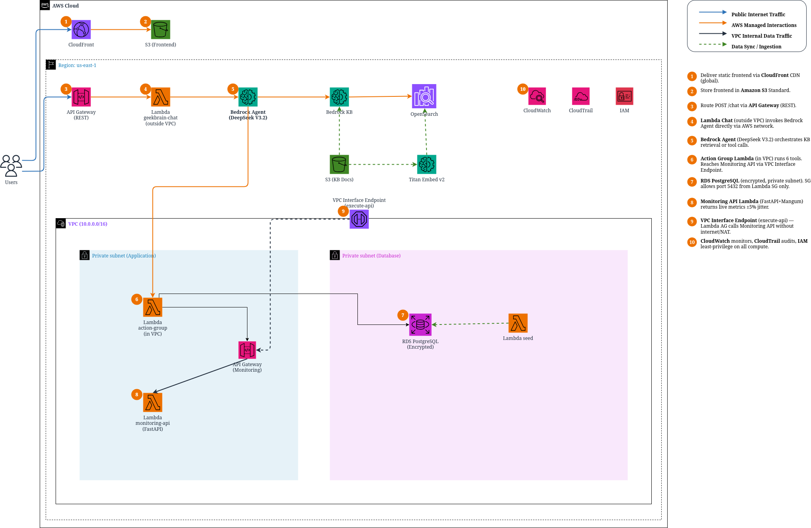
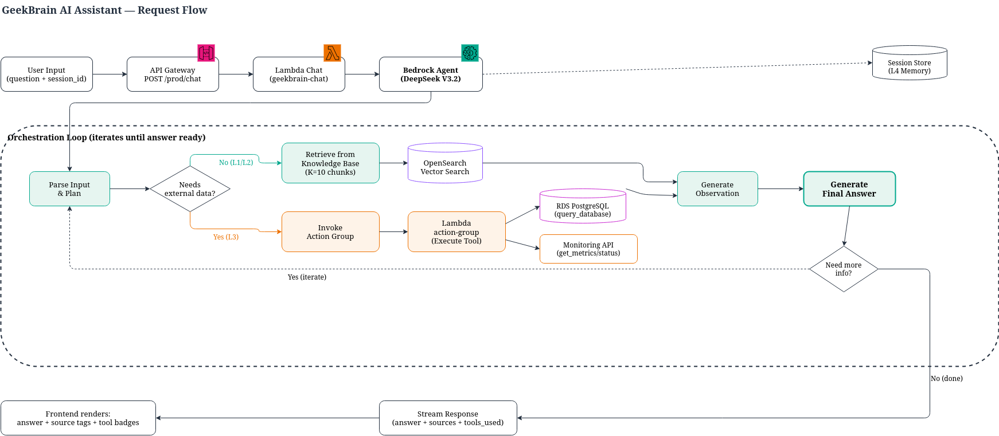
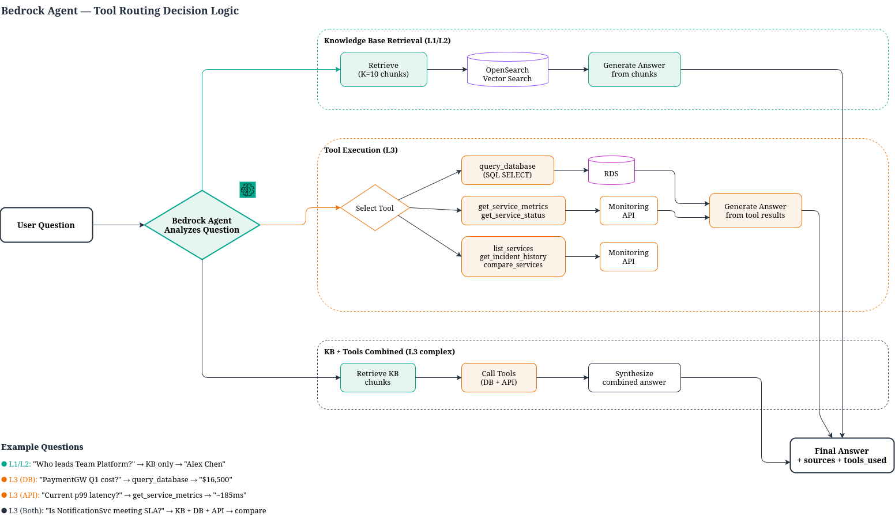
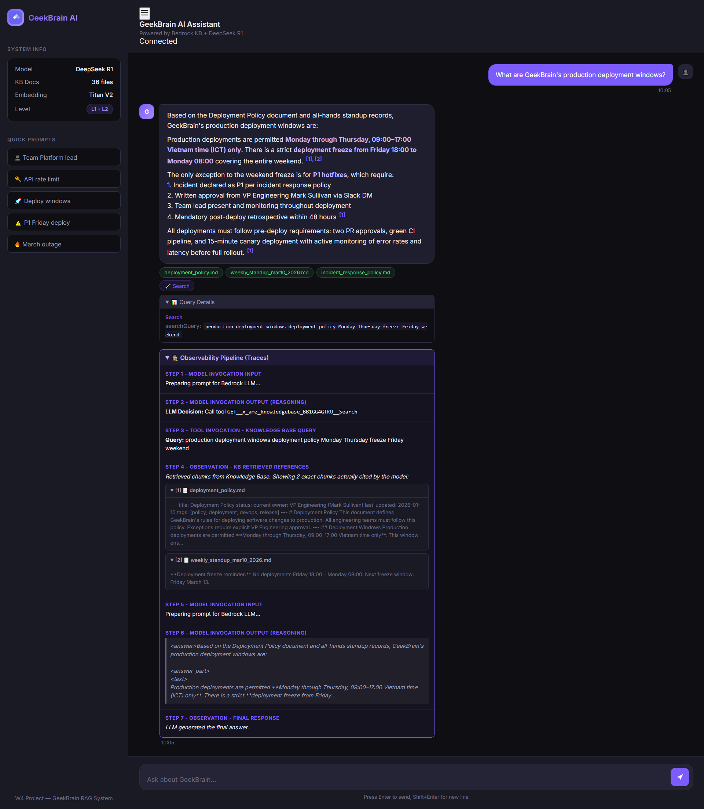
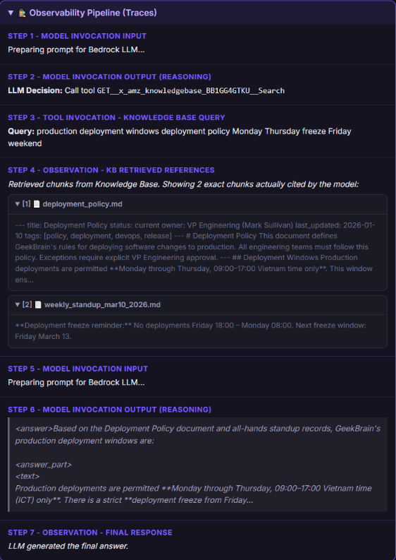
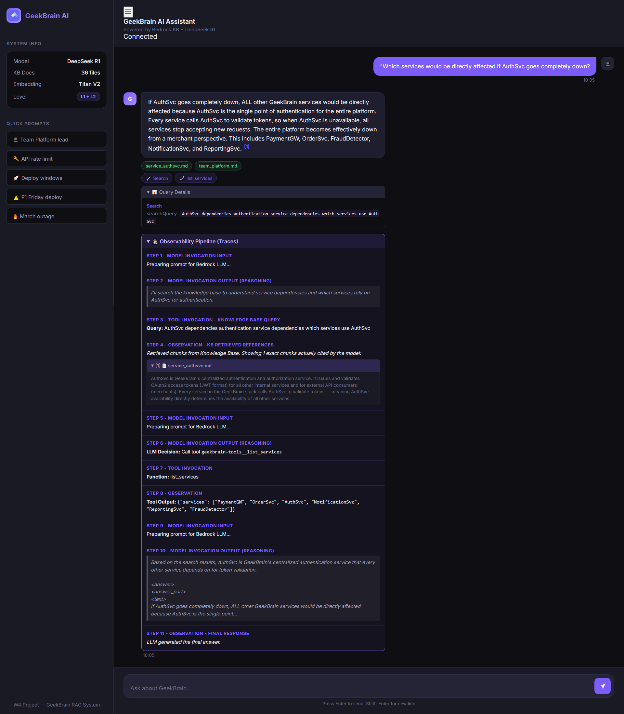
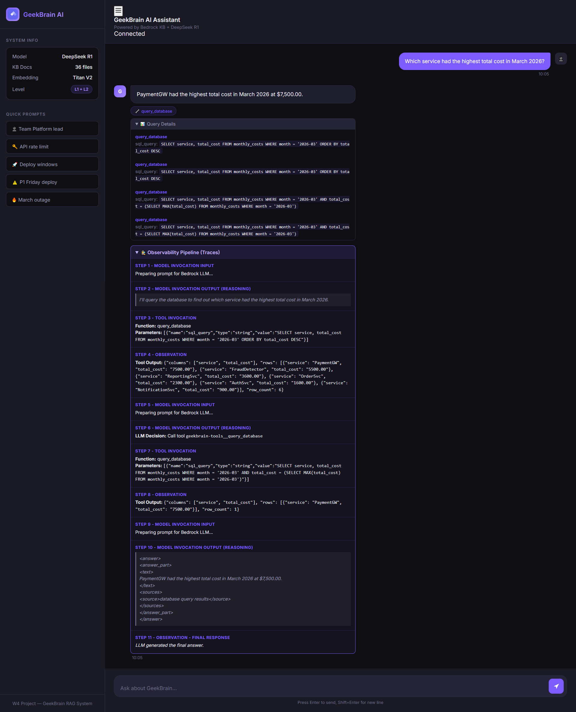
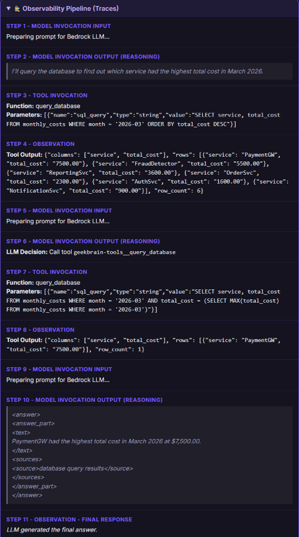
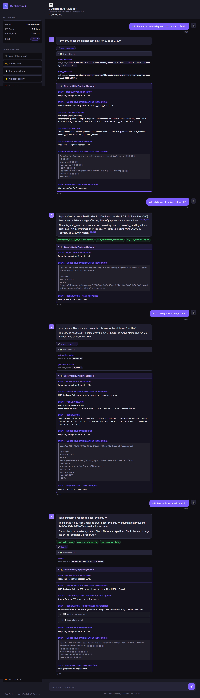
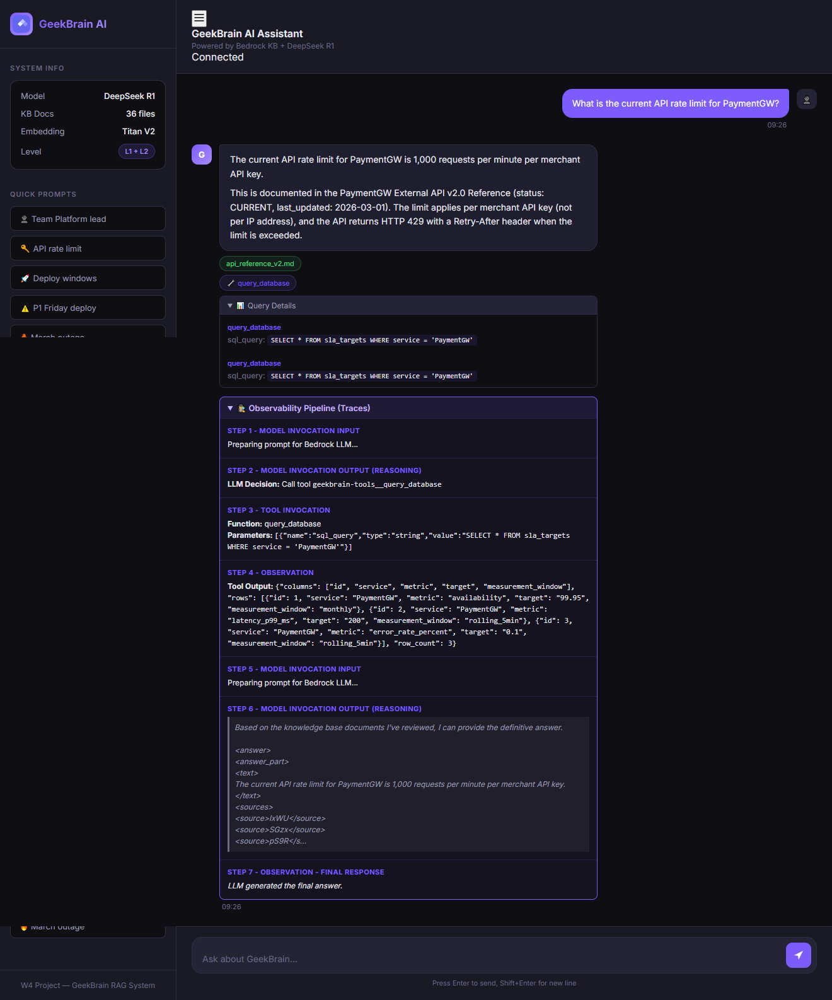

# W4 Evidence Pack — GeekBrain AI Assistant

## Section 1 — Cover

| Field | Value |
|-------|-------|
| **Group** | Group 9 |
| **Members** | 1. Lê Hoàng Trung Kiên<br>2. Trần Đình Bảo Long<br>3. Nguyễn Đức Chinh<br>4. Nguyễn Hữu Định<br>5. Trương Thị Mỹ Quyên<br>6. Trần Văn Đức<br>7.Hoàng Trọng Tấn
| **Mentor** | Anh Quang Phùng (Quality Assurance Lead, TechX) |
| **LLM** | DeepSeek V3.2 via Amazon Bedrock |
| **Framework** | Amazon Bedrock Agents (managed orchestration) |
| **Repository** | |

---

## Section 2 — Architecture Overview

### System Architecture



### Request Flow Diagram

> See `docs/diagrams/w4_request_flow.drawio`



### Tool Routing Diagram

> See `docs/diagrams/w4_tool_routing.drawio`



### Component List

| Component | Scope | Role |
|-----------|-------|------|
| **CloudFront + S3** | Global | Hosts chat frontend (HTML/CSS/JS) |
| **API Gateway (Chat)** | Regional | REST endpoint, routes POST /chat to Lambda |
| **Lambda Chat** | Regional (outside VPC) | Invokes Bedrock Agent directly via AWS network |
| **Bedrock Agent** | Regional | Orchestrates KB retrieval + tool calling + LLM reasoning |
| **Knowledge Base** | Regional | RAG: S3 docs → Titan Embed v2 → OpenSearch Serverless |
| **OpenSearch Serverless** | Regional | Vector store (HNSW, 1024d) |
| **Action Group Lambda** | VPC (private subnet) | Executes 6 tools (DB queries, API calls) |
| **RDS PostgreSQL** | VPC (private subnet) | Structured data (costs, incidents, SLAs, metrics) |
| **Monitoring API Lambda** | VPC (private subnet) | FastAPI+Mangum returning live service metrics |
| **API Gateway (Monitoring)** | Regional | Exposes Monitoring API to Action Group Lambda |
| **VPC Interface Endpoint** | VPC border | Routes execute-api calls without internet/NAT |

### Data Flow

1. User types question in frontend → POST to API Gateway `/prod/chat`
2. API Gateway triggers `geekbrain-chat` Lambda (outside VPC)
3. Lambda calls `bedrock-agent-runtime.invoke_agent()` with question + session_id (AWS internal network, no NAT needed)
4. Bedrock Agent decides: retrieve from KB, call tool, or both
5. If KB needed → retrieves relevant chunks from OpenSearch Serverless
6. If tool needed → invokes Action Group Lambda (in VPC private subnet)
7. Action Group Lambda executes tool:
   - **query_database** → RDS PostgreSQL (same VPC, SG allows port 5432)
   - **get_service_metrics/status** → Monitoring API via VPC Interface Endpoint (no internet)
8. Agent synthesizes KB chunks + tool results → generates final answer
9. Response streams back through Lambda → API Gateway → frontend

**Key networking decisions:**
- Lambda Chat runs **outside VPC** (no `vpc_config`) — calls Bedrock API directly via AWS internal network
- Action Group Lambda runs **inside VPC** — reaches RDS directly, reaches Monitoring API via VPC Interface Endpoint (`com.amazonaws.us-east-1.execute-api`)
- **No NAT Gateway** needed — all external calls use VPC endpoints or run outside VPC

---

## Section 3 — Decision Log

### Decision 1: Bedrock Agents vs Custom RAG Pipeline

**Chose:** Amazon Bedrock Agents with managed orchestration

**What we learned:** Bedrock Agents handle the tool-calling loop automatically — the agent decides when to retrieve from KB vs call a tool. This eliminated the need to write custom routing logic. Trade-off: less control over exactly when tools are called, but faster to production.

### Decision 2: VPC Interface Endpoint vs NAT Gateway

**Chose:** VPC Interface Endpoint for API Gateway (`execute-api`) instead of NAT Gateway

**What we learned:** The Action Group Lambda needs to call the Monitoring API (behind a separate API Gateway). Instead of routing through NAT → internet → API GW, we use a VPC Interface Endpoint with `private_dns_enabled = true`. This keeps traffic on AWS backbone, removes NAT Gateway cost (~$32/month), and reduces latency.

### Decision 3: Lambda Chat Outside VPC

**Chose:** Lambda Chat without `vpc_config` (runs in AWS-managed network)

**What we learned:** Lambda Chat only calls Bedrock Agent API — it doesn't need VPC access. Running outside VPC avoids cold start delays from ENI attachment (~5-10s), eliminates NAT dependency, and simplifies the network architecture.

### What Didn't Work

**Tried:** DeepSeek V3.2 model configuration via Terraform `foundation_model` parameter.

**Failed because:** The Bedrock API returned errors when trying to set DeepSeek V3.2 programmatically.

**Switched to:** `lifecycle { ignore_changes = [foundation_model] }` in Terraform + manual console configuration.

---

## Section 4 — Per-Level Evidence

### L1 — Simple RAG (Retrieval)

**Screenshot:** correct answer with source document cited

<!-- TODO: Chụp screenshot frontend showing answer + green source tag -->


**Proof:** log showing retrieval happened (source tags visible in frontend)

<!-- TODO: Chụp screenshot showing source document badges -->


**Test questions used:**

| ID | Question | Expected Answer |
|----|----------|----------------|
| L1-01 | What is the current API rate limit for PaymentGW? | 1000 req/min per merchant |
| L1-02 | Who leads Team Platform and what services do they own? | Alex Chen. Owns PaymentGW + AuthSvc |
| L1-03 | What was the root cause of the March 5, 2026 PaymentGW outage? | Circuit breaker stuck OPEN |
| L1-04 | What is GeekBrain's data retention policy for transaction logs? | 7 years |
| L1-05 | What are GeekBrain's production deployment windows? | Mon-Thu 09:00-17:00 VN |
| L1-06 | What authentication method does the PaymentGW API use? | API key + HMAC-SHA256 |
| L1-07 | What message queue does NotificationSvc use? | Amazon SQS |
| L1-08 | After March 5 incident, circuit breaker review deadline? | April 15, 2026 |
| L1-09 | What programming language is AuthSvc written in? | Go |
| L1-10 | How often does GeekBrain rotate JWT signing keys? | Every 30 days |

---

### L2 — Multi-Source Retrieval (Conflict Resolution)

**Screenshot:** correct multi-doc synthesis or conflict resolution

<!-- TODO: Chụp screenshot showing conflict resolution (e.g., API rate limit 1000 vs 500) -->


**How the system handles conflicts:** Agent instruction includes *"When documents conflict, prefer the most recent version and status='current' over 'archived'. State the conflict explicitly."*

**Test questions used:**

| ID | Question | Expected Answer |
|----|----------|----------------|
| L2-01 | What is PaymentGW's API rate limit? | 1000 (v2 supersedes v1's 500) |
| L2-02 | P1 bug in OrderSvc at 21:00 Friday — can they deploy? | Yes, P1 overrides freeze with VP approval |
| L2-03 | Which services affected if AuthSvc goes down? | PaymentGW + OrderSvc |
| L2-04 | Top priorities for cost reduction and why? | PaymentGW + FraudDetector |
| L2-05 | Common lessons from March 2026 incidents? | Both need automated monitoring |
| L2-06 | What should new Team Data engineer know? | Ryan Blake lead, PCI-DSS training |
| L2-07 | NotificationSvc concerns + proposed fix? | SQS consumer auto-scaling |
| L2-08 | Complete P1 escalation path for PaymentGW? | Alex Chen → Mark Sullivan → James Wright |

---

### L3 — Tool-Augmented RAG

**Screenshot:** correct numerical answer (showing tool badge)

<!-- TODO: Chụp screenshot showing answer + purple tool badge + query details -->


**Proof:** tool call log showing the tool was called and returned real data

<!-- TODO: Chụp screenshot showing expanded "Query Details" section -->


**Test questions used:**

| ID | Question | Expected Answer | Tool |
|----|----------|----------------|------|
| L3-01 | What is PaymentGW's current p99 latency? | ~185ms | get_service_metrics |
| L3-02 | Total infrastructure cost ALL services Q1 2026? | $56,350 | query_database |
| L3-03 | Highest cost service March 2026? | PaymentGW $7,500 | query_database |
| L3-04 | Is PaymentGW error rate within SLA? | Yes. 0.08% vs 0.1% target | metrics + DB |
| L3-05 | PaymentGW current p99 vs Q1 average? | ~185ms vs ~183ms | metrics + DB |
| L3-06 | Is NotificationSvc meeting SLA? | No. 3200ms > 2000ms, 2.1% > 1.0% | metrics + DB |
| L3-07 | PaymentGW cost increase Q4→Q1? | $11,700→$16,500 (+41%) | query_database |
| L3-08 | Most requests per minute? | AuthSvc ~28,000 rpm | get_service_metrics |
| L3-09 | FraudDetector CPU vs others? | 72%. NotificationSvc highest 88% | get_service_metrics |
| L3-10 | Total incidents Q1 2026? | 7 incidents, PaymentGW had 3 | query_database |

**Tools registered:**

| Tool | Data Source |
|------|-------------|
| `query_database` | RDS (monthly_costs, incidents, sla_targets, daily_metrics) |
| `get_service_status` | Monitoring API `/status/{svc}` |
| `get_service_metrics` | Monitoring API `/metrics/{svc}` |
| `list_services` | Monitoring API `/services` |
| `get_incident_history` | Monitoring API `/incidents/{svc}` |
| `compare_services` | Monitoring API (aggregates all) |

---

### L4 — Memory (Multi-turn Conversation)

**Screenshot:** 3-4 turn conversation where follow-ups reference prior turns

<!-- TODO: Chụp screenshot showing full multi-turn conversation -->


**Test conversation:**

| Turn | Question | Resolution |
|------|----------|------------|
| 1 | "Which service had the highest infrastructure cost in March 2026?" | → query_database → PaymentGW $7,500 |
| 2 | "Why did its costs spike?" | "its" = PaymentGW → KB → postmortem INC-005 |
| 3 | "Which team is responsible?" | context = PaymentGW → Team Platform, Alex Chen |
| 4 | "The postmortem mentioned a review deadline. Is it overdue?" | April 15 deadline → Yes, overdue |

**Memory strategy:** Bedrock Agent session via `sessionId` parameter (TTL: 1800s). Frontend generates unique ID per browser session.

---

### Bonus A — Observability Dashboard

**Screenshot:** dashboard showing question being processed — retrieval, tool calls, LLM decisions visible

<!-- TODO: Chụp screenshot showing tool badges + source tags + expanded query details -->


Frontend displays pipeline internals alongside each answer:
- **Source tags** (green) — KB documents cited
- **Tool badges** (purple) — tools called
- **Query Details** (collapsible) — exact SQL/parameters

Implemented in `frontend/app.js` by parsing response fields: `sources`, `tools_used`, `tool_details`.

---

### Bonus C — Knowledge Base Sync

KB sync automated via Terraform. When docs change (MD5 hash trigger):

1. Upload `.md` files to S3
2. `null_resource.kb_sync` → `aws bedrock-agent start-ingestion-job`
3. Polls until COMPLETE (timeout: 10 min)

**Evidence:** `terraform/modules/ai_engine/main.tf` — `kb_sync` resource.

---

## Section 5 — Reflection

**Hardest level:** L3 — Tool-Augmented RAG

**Why:** Getting the Bedrock Agent to route correctly between KB retrieval and tool calls required extremely precise tool descriptions. "Gets data" is useless — "Returns CURRENT live metrics; for HISTORICAL data use query_database" made the difference. We iterated on descriptions multiple times before the agent consistently chose the right tool.

**What we would do differently with one more day:**

- Add query rewriting for L4 to improve retrieval on follow-up questions with pronouns
- Implement automated testing with the provided question JSON files to measure accuracy
- Add fallback error messages when the Monitoring API is unreachable

---

## Appendix — Infrastructure as Code

```bash
cd terraform
terraform init
terraform plan
terraform apply   # ~15 min for full stack
```

| Module | Resources |
|--------|-----------|
| `ai_engine` | S3 bucket, OpenSearch Serverless, Bedrock KB + data source, ingestion |
| `backend` | Bedrock Agent + alias, Action Group, Lambda Chat, Lambda AG, API Gateway |
| `monitoring_api` | FastAPI Lambda, API Gateway (Monitoring) |
| `database` | RDS PostgreSQL, seed Lambda |
| `network` | VPC, 2 public + 2 private subnets, SGs, VPC Interface Endpoint (execute-api) |
| `frontend` | S3 bucket, CloudFront distribution |
